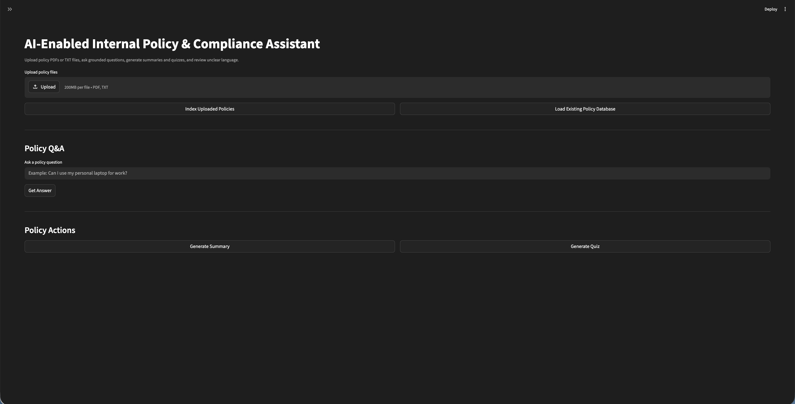
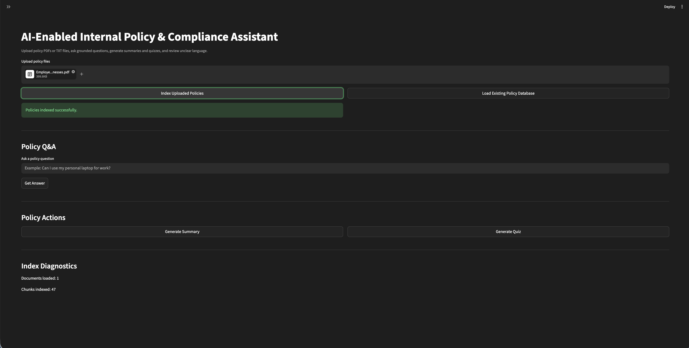
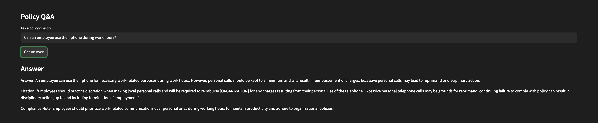
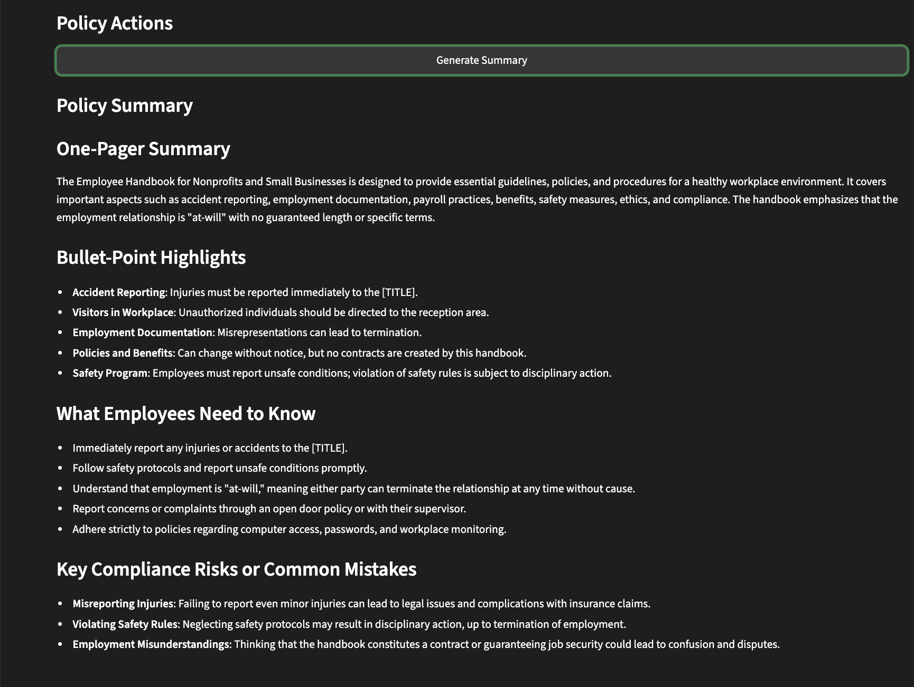
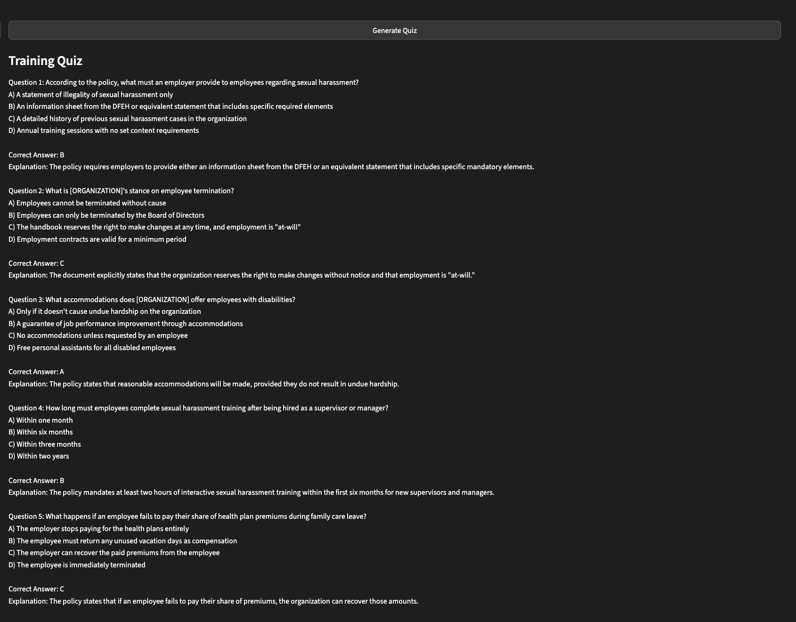

#  AI Policy & Compliance Assistant

An AI-powered internal policy assistant that uses a local RAG system to analyze policy documents, answer questions, generate summaries, and create training quizzes.

---

##  Features
- Upload policy PDFs or TXT files
- Grounded Q&A using document context only
- Automatic policy summaries
- AI-generated training quizzes
- Persistent vector database (ChromaDB)
- Clean Streamlit web interface

---

##  How it works
1. Upload policy documents (PDF or TXT)
2. Text is extracted and chunked
3. Data is embedded and stored in ChromaDB
4. Queries are answered using retrieved context only
5. Outputs include answers, summaries, and quizzes

---

##  Tech Stack
- Python
- LlamaIndex
- Ollama (qwen2.5)
- ChromaDB
- HuggingFace Embeddings
- Streamlit

---

##  Demo

### Upload & Index Policies

### Policy Q&A (with citations)

### Generated Summary

### Training Quiz

---

##  How to Run
Make sure the project folder (AI-Policy-Assistant) is on your Desktop.

Setup & Run
1. Open Terminal and go to the project folder

cd ~/Desktop/AI-Policy-Assistant

2. Create a virtual environment

python3.11 -m venv venv

3. Activate the environment

source venv/bin/activate

4. Install required packages

pip install -r requirements.txt

5. Install the model

ollama pull qwen2.5:7b

6. Run the app

python3.11 -m streamlit run PolicyApp.py

Using the App
	1	Upload a policy PDF (included in the data folder or your own)
	2	Click “Index Uploaded Policies”
	3	Then you can:
	◦	Ask questions
	◦	Generate summaries
	◦	Generate quizzes
